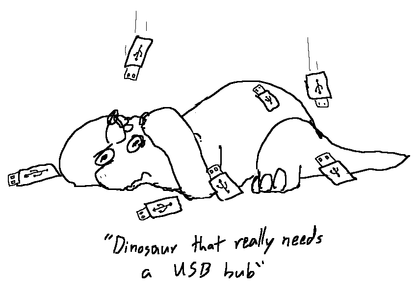
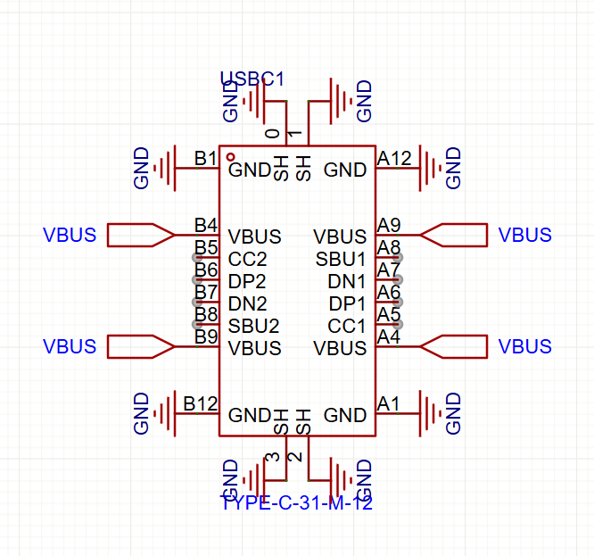
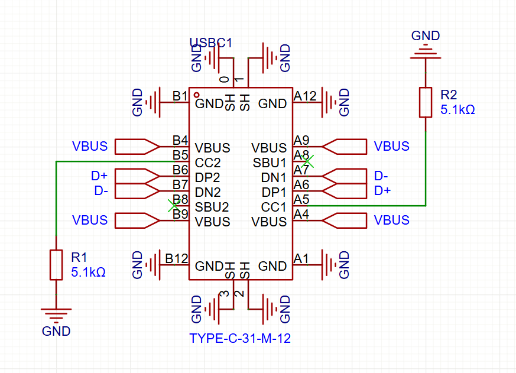
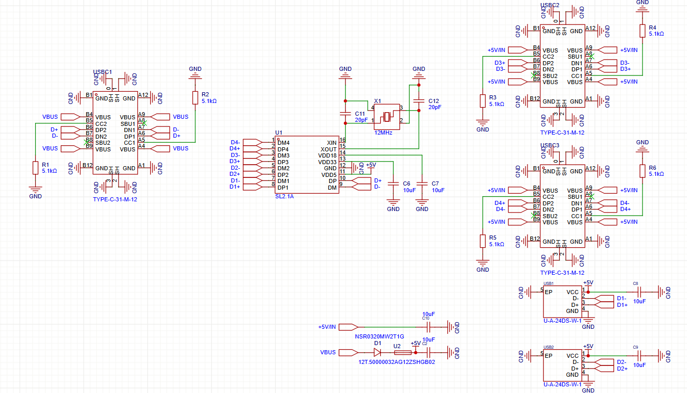
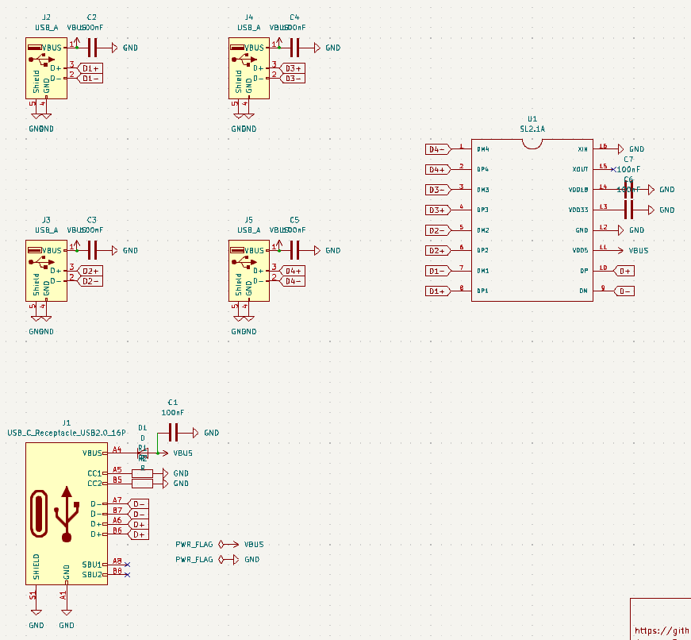

----
Total Time Spent: *TBA*

# Scrappy Tail

## Entry 1 - 2025/07/04

### Time spent: 30 minutes of pre-research

USBs are... a complex thing. I decided I want to challenge myself into doing something special with them: a USB Hub. Before I took on this idea and turned it into something, research was definitely needed.

so in the world of growing technology, why go with USB-A when USB Type-C is the norm, the standard nowadays? of course i'm not going for anything crazy like USB 3.0 (or later) - that looks scary, or even thunderbolt :skull:. USB 2.0 was good enough for me, so here we go...

## Entry 2 - 2025/07/05

### Time spent: 5 hours

i've sort of had experience with USB Receptacles in KiCAD, but since I was learning how to use EasyEDA Pro Desktop, figured i might as well do it in EasyEDA. unfortunately that means i'll be using whatever symbol the manufacturer of the part is using, unlike the simple symbols in KiCAD, but i'll have to deal with it

ahh.... yeah, the USB Type-C experience... reversible but complex :sob:

okay, that's much better! :p

yeah basically with type-c the other side is the reversible part, so it's pretty much the same.

i'm not doing anything fancy with protocols (thunderbolt, displayport, hdmi, etc) so SBU is unconnected, however i've added pull-down resistors to CC pins because they're not a pwr src!

*4 hours later...*

yeah, it's messy but whatever, no DRC errors.

## Entry 3 - 2025/07/16

### Time spent: 3 hours

okay woah, it's been a while.

Undercity wrapped up, and it was a blast. as of right now i'm in germany, waiting for my transiting flight to Shanghai for yet another hackathon.

i decided to have a change of plan for this project, because i can't spend as much time, so i'm switching to KiCAD, and making some changes to some of the specifications.

SL2.1A controller remains the same, but i've decided to use 4 USB Type-A receptacles instead, however the schematic is pretty much the same.

