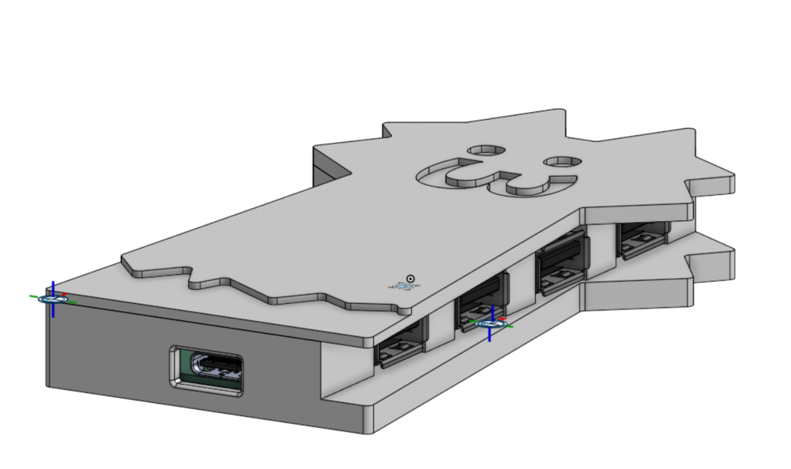

----

### Total Time Spent: ~15ish hours

# Scrappy Tail

## Entry 1 - 2025/07/04

### Time spent: 30 minutes of pre-research

USBs are... a complex thing. I decided I want to challenge myself into doing something special with them: a USB Hub. Before I took on this idea and turned it into something, research was definitely needed.

so in the world of growing technology, why go with USB-A when USB Type-C is the norm, the standard nowadays? of course i'm not going for anything crazy like USB 3.0 (or later) - that looks scary, or even thunderbolt :skull:. USB 2.0 was good enough for me, so here we go...

## Entry 2 - 2025/07/05

### Time spent: 5 hours

i've sort of had experience with USB Receptacles in KiCAD, but since I was learning how to use EasyEDA Pro Desktop, figured i might as well do it in EasyEDA. unfortunately that means i'll be using whatever symbol the manufacturer of the part is using, unlike the simple symbols in KiCAD, but i'll have to deal with it

ahh.... yeah, the USB Type-C experience... reversible but complex :sob:

okay, that's much better! :p

yeah basically with type-c the other side is the reversible part, so it's pretty much the same.

i'm not doing anything fancy with protocols (thunderbolt, displayport, hdmi, etc) so SBU is unconnected, however i've added pull-down resistors to CC pins because they're not a pwr src!

*4 hours later...*

yeah, it's messy but whatever, no DRC errors.

## Entry 3 - 2025/07/16

### Time spent: 3 hours

okay woah, it's been a while.

Undercity wrapped up, and it was a blast. as of right now i'm in germany, waiting for my transiting flight to Shanghai for yet another hackathon.

i decided to have a change of plan for this project, because i can't spend as much time, so i'm switching to KiCAD, and making some changes to some of the specifications.

SL2.1A controller remains the same, but i've decided to use 4 USB Type-A receptacles instead, however the schematic is pretty much the same.

## Entry 4 - 2025/07/17

## Time spent: 2 hours

very tired, but i managed to get some wiring done, yay.....

i mean, i don't know how to make that look a better shape. usb type-c receptacle at the front (that's where the tail comes from) and usb type-a on the sides.

i've decided to space 8.0mm between each receptacle even though the USB specification recommends 12.0mm, because if i did that then my pcb would be longer than 100.0mm (expensive!)

let's add some silkscreen art, and what better way than to add all the scrappy cat pfps that Hack Clubbers have?!

(3dmodels hidden)

shout out if you're on here btw :3 (i couldn't find anymore T-T)

yeah anyways, DRC no errors so all is good! (i just hope that JLCPCB is able to PCBA this as some of the footprints im using are wacky :sob:)

# Entry 5 - 2025/07/18

## Time spent: 4 hours

CAD time!

onshape as usual, and obviously, if i'm going for a scrappy cat design, then i'm totally gonna have scrappy cat case! i'm really bad at CAD though, so i though i made the rectangular part first, then gradually built the cat shape on top, it would come out fine.

it's a.. box. yay?

okey, so i drew some lines here and there, and made some cutouts for my usb receptacles, and now it's starting to take shape!

and now create the lid...

combine together for the final case!

anyways uhh. i think that's BASICALLY it!
