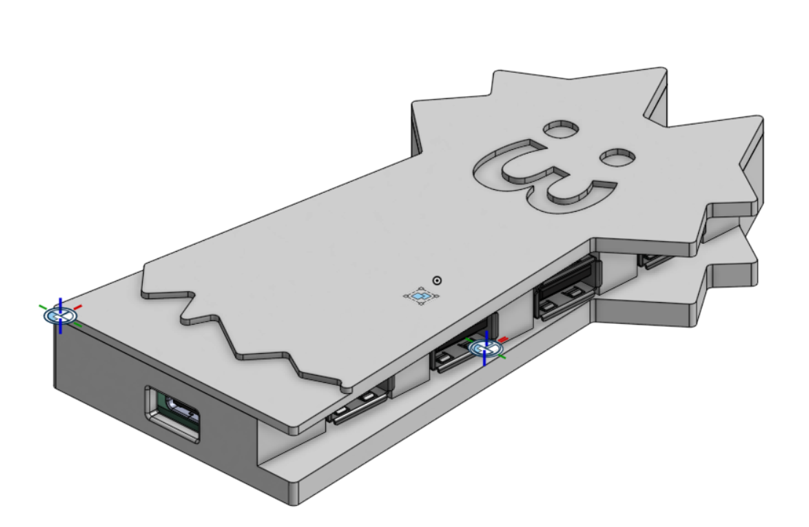
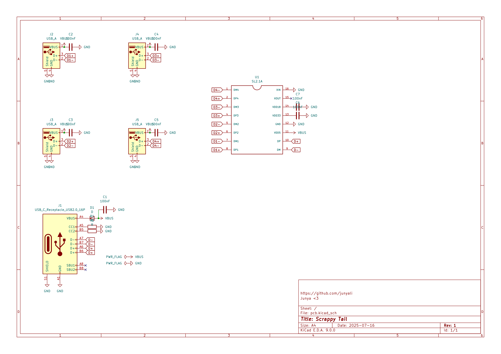
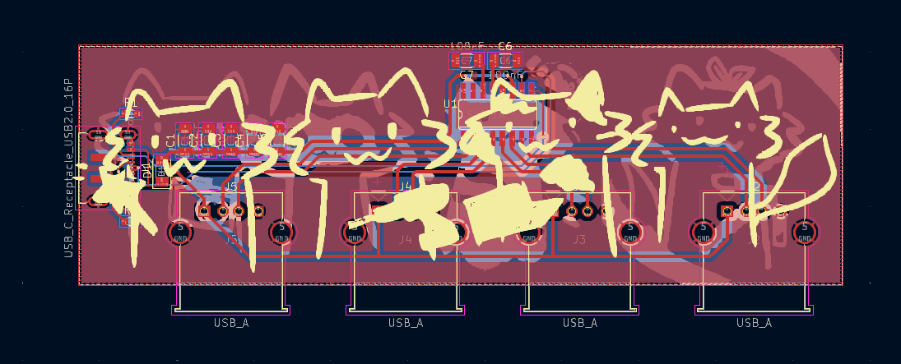
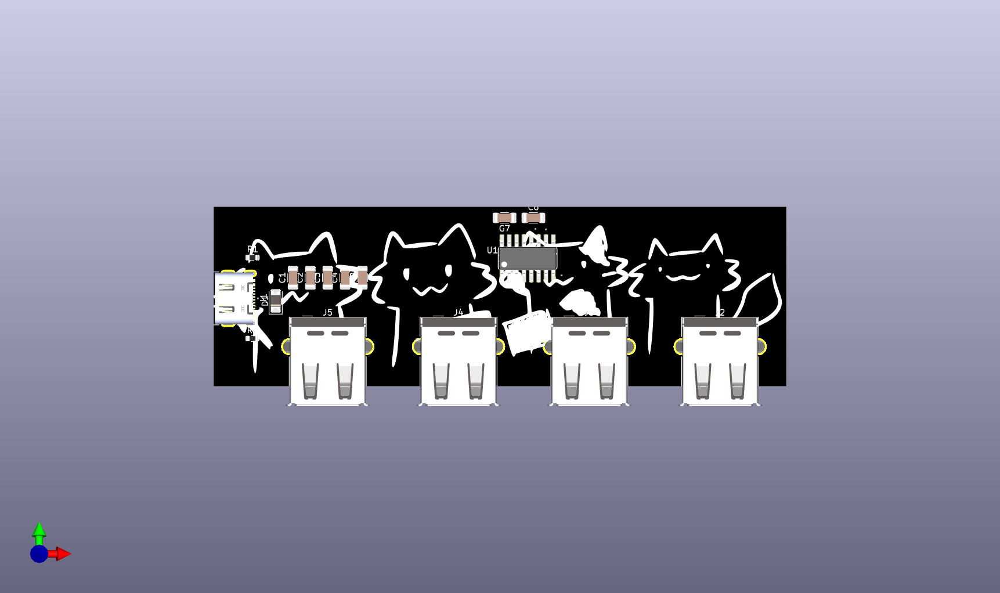
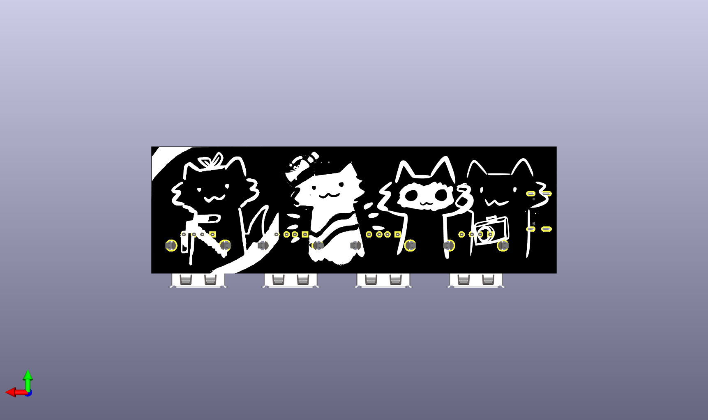

# Scrappy Tail

A DIY USB 2.0 Hub with 4 Type-A ports and a Type-C input, with a cute 3D printed scrappy cat case!! :3

Scrappy Tail connects to your device using USB Type-C (hence the cable making it look like a tail!) and gives you 4 additional USB Type-A ports. It uses the SL2.1A hub controller, so it uses USB 2.0 interface and thus speeds are limited to 480Mbps

PCB designed in KiCAD and CAD designed in OnShape. 

# Preview

| Description         | Image                            |
|---------------------|----------------------------------|
| Schematic           |       |
| PCB                 |             |
| 3D PCB Render Front |    |
| 3D PCB Render Back  |     |
| CAD + PCB           |  |

# BOM

This one's a bit of an expensive one thanks to the PCBA fees.

See the original BOM under `bom.csv`

## PCB Prototype + individual components only

| Component                                                         | Quantity | LCSC Part #     | Price (USD) | LCSC Link                                                                                                                        |
|-------------------------------------------------------------------|----------|-----------------|-------------|----------------------------------------------------------------------------------------------------------------------------------|
| 100uF Ceramic Capacitor                                           | 7        | CL31A107MQHNNNE | 0.34        | https://lcsc.com/product-detail/Multilayer-Ceramic-Capacitors-MLCC-SMD-SMT_Samsung-Electro-Mechanics-CL31A107MQHNNNE_C15008.html |
| Schottky Diode 1206                                               | 1        | C466498         | 0.47        | https://lcsc.com/product-detail/Schottky-Diodes_High-Diode-SS14_C466498.html                                                     |
| USB C Receptacle JAE DX07S016JA1R1500                             | 1        | C3197885        | 0.97        | https://lcsc.com/product-detail/USB-Connectors_JAE-DX07S016JA1R1500_C3197885.html                                                |
| USB A Receptacle Molex 67643 Horizontal                           | 4        | C2765194        | 0.88        | https://lcsc.com/product-detail/USB-Connectors_JAE-DX07S016JA1R1500_C3197885.html                                                |
| 5.1kΩ Resistor 0603                                               | 2        | C105580         | 0.12        | https://lcsc.com/product-detail/Chip-Resistor-Surface-Mount_YAGEO-RC0603FR-075K1L_C105580.html                                   |
| CoreChips SL2.1A                                                  | 1        | C192893         | 1.31        | https://lcsc.com/product-detail/USB-HUB-Controllers_CoreChips-SL2-1A_C192893.html                                                |
| PCB manufactured by JLCPCB (incl shipping, taxes, customs)        | 5        | N/A             | 3.10        | https://jlcpcb.com                                                                                                               |
| Economic PCBA assembled by JLCPCB (incl shipping, taxes, customs) | 2        | N/A             | 52.38       | https://jlcpcb.com                                                                                                               |

Subtotal (excluding PCBA): `US$7.19`

Estimated cost (PCBA which includes parts and PCB): `US$55.48`